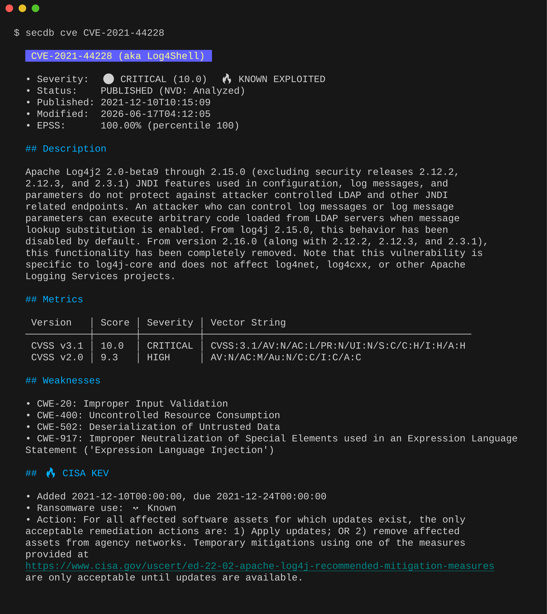

# ZEN SecDB CLI

[](https://github.com/giterlizzi/secdb-cli/actions/workflows/ci.yml)
[](https://github.com/giterlizzi/secdb-cli/actions/workflows/release.yml)
[](https://github.com/giterlizzi/secdb-cli/releases)
[](LICENSE)

Command-line client for the [ZEN SecDB](https://secdb.nttzen.cloud) API.

## Installation

```bash
go install github.com/giterlizzi/secdb-cli@latest
```

Or clone and build locally (requires Go 1.26+):

```bash
git clone https://github.com/giterlizzi/secdb-cli
cd secdb-cli
make build
```

Pre-built binaries for Linux, macOS and Windows (amd64/arm64) are published on the [Releases](https://github.com/giterlizzi/secdb-cli/releases) page via GoReleaser.

## Configuration

| Environment variable    | Purpose                                                                |
|-------------------------|------------------------------------------------------------------------|
| `SECDB_API_KEY`         | API key sent as the `X-API-KEY` header on every request                |
| `SECDB_NO_UPDATE_CHECK` | Set to any value to disable the background update check                |
| `NO_COLOR`              | Print raw Markdown instead of ANSI-styled `text` output                |
| `CI`                    | Automatically disables the background update check when set            |

`--base-url` overrides the API endpoint (default: `https://secdb.nttzen.cloud/`).

## Usage

### Look up a CVE

```bash
secdb cve CVE-2021-44228
```

Renders a curated, human-readable report (CVSS v2/v3/v4, SSVC, EPSS, CISA KEV status, weaknesses, exploit maturity, affected vendors/products and advisories) as Markdown, syntax-highlighted in an interactive terminal.



### Output formats

Supports `-o` / `--output`:

| Format | Description |
|---|---|
| `text` *(default)* | Curated Markdown report, rendered with ANSI styling in a terminal, printed raw when piped/redirected |
| `yaml` | Raw API response as YAML |
| `json` | Raw API response as JSON |
| `template` | Custom [Go template](https://pkg.go.dev/text/template) via `--template` (inline) or `--template-file` |
| `html` | Custom HTML via `--template`/`--template-file`, rendered with `html/template` (safe escaping) |

```bash
secdb cve CVE-2021-44228 -o json
secdb cve CVE-2021-44228 -o template --template '{{.severity}}: {{.score}}'
```

Templates have access to [Sprig](https://masterminds.github.io/sprig/) functions (string manipulation, math, lists, dates, ...) in addition to the Go template built-ins. The `env`, `expandenv`, and `getHostByName` functions are disabled to prevent untrusted templates from reading environment variables (e.g. `SECDB_API_KEY`) or exfiltrating data over the network.

### Audit PURLs against known vulnerabilities

```bash
secdb audit purl pkg:maven/org.apache.logging.log4j/log4j-core@2.17.0
secdb audit purl --file=purls.txt
secdb audit purl < purls.txt
command | secdb audit purl
cdxgen -o bom.json . && secdb audit purl --sbom bom.json
```

Package URLs ([PURLs](https://github.com/package-url/purl-spec)) can be passed as arguments, read from a file with `--file`/`-f` (one PURL per line, `#` for comments), from CycloneDX SBOM file, or piped via stdin.

| Flag | Description |
|---|---|
| `-f`, `--file` | Read PURLs from a file instead of arguments/stdin |
| | `--sbom` | Read PURLs from CycloneDX SBOM file instead of arguments/stdin/file |
| `-v`, `--view` | `summary` *(default)* — one row per package, or `details` — one row per advisory (only applies to `--output=text`) |
| `--fail-on` | Exit with status `2` if any package has a vulnerability at or above the given severity (`critical`, `high`, `medium`, `low`, `info`) |

```bash
secdb audit purl --file=purls.txt --fail-on=high
```

Useful in CI pipelines to fail the build when high/critical vulnerabilities are found.

### Check for a new version

```bash
secdb check-update   # alias: secdb update
```

A lightweight background check also runs automatically on every command (cooldown: 24h, silent on failure, skipped in CI or with `SECDB_NO_UPDATE_CHECK` set).

## License

[Apache License 2.0](LICENSE).

Third-party dependency attributions are listed in [THIRD-PARTY-NOTICES.md](THIRD-PARTY-NOTICES.md).
