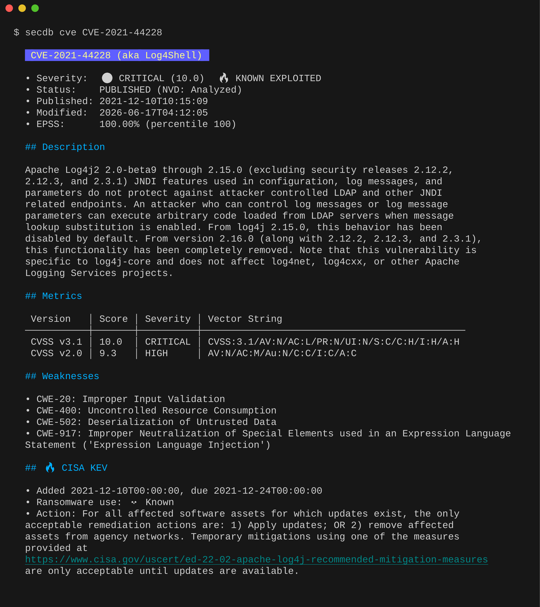

# ZEN SecDB CLI

[](https://github.com/giterlizzi/secdb-cli/actions/workflows/ci.yml)
[](https://github.com/giterlizzi/secdb-cli/actions/workflows/release.yml)
[](https://github.com/giterlizzi/secdb-cli/releases)
[](LICENSE)

Command-line client for the [ZEN SecDB](https://secdb.nttzen.cloud) API.

## Installation

```bash
go install github.com/giterlizzi/secdb-cli@latest
```

Or clone and build locally (requires Go 1.26+):

```bash
git clone https://github.com/giterlizzi/secdb-cli
cd secdb-cli
make build
```

Pre-built binaries for Linux, macOS and Windows (amd64/arm64) are published on the [Releases](https://github.com/giterlizzi/secdb-cli/releases) page via GoReleaser.

## Configuration

| Environment variable    | Purpose                                                                 |
|-------------------------|-------------------------------------------------------------------------|
| `SECDB_API_KEY`         | API key sent as the `X-API-KEY` header on every request                 |
| `SECDB_DEBUG`           | Set to any value to enable debug logging to stderr (same as `--debug`)  |
| `SECDB_NO_UPDATE_CHECK` | Set to any value to disable the background update check                 |
| `NO_COLOR`              | Print raw Markdown instead of ANSI-styled `text` output                 |
| `CI`                    | Automatically disables the background update check when set             |
| `SECDB_WEBHOOK_URL`     | Generic webhook endpoint for `--notify` (see [Notifications](docs/notifications.md)) |
| `SECDB_SLACK_WEBHOOK`   | Slack Incoming Webhook URL for `--notify`                               |
| `SECDB_TEAMS_WEBHOOK`   | Microsoft Teams (Power Automate Workflows) webhook URL for `--notify`   |

`--base-url` overrides the API endpoint (default: `https://secdb.nttzen.cloud/`). It can include a path, e.g. a proxy at `https://gateway.example.com/secdb`.

The links in the output (CVE, CWE and advisory pages, the report footer, the notifications' "view details", the editor diagnostics) point to the ZEN SecDB web GUI, which by default is on the same host as the API. When the API is reached through a proxy, set `--web-url` to the GUI address, so the links don't point to the proxy:

```bash
secdb --base-url https://gateway.example.com/secdb --web-url https://secdb.nttzen.cloud cve CVE-2021-44228
```

## Usage

### Look up a CVE

```bash
secdb cve CVE-2021-44228
```

Renders a curated, human-readable report (CVSS v2/v3/v4, SSVC, EPSS, CISA KEV status, weaknesses, exploit maturity, affected vendors/products and advisories) as Markdown, syntax-highlighted in an interactive terminal.



### Output formats

`-o` / `--output` selects the format: `text` *(default, a Markdown report rendered in the terminal)*, `json`, `yaml`, `template` and `html` (custom Go templates), plus `sarif` and `csv` for the `audit` commands.

```bash
secdb cve CVE-2021-44228 -o json
secdb cve CVE-2021-44228 -o template --template '{{.severity}}: {{.score}}'
```

See [Output formats](docs/output.md) for the details and the functions available to templates.

### Audit packages against known vulnerabilities

```bash
# Package URLs, from arguments, a file or stdin
secdb audit purl pkg:maven/org.apache.logging.log4j/log4j-core@2.14.1

# A dependency manifest, or every manifest under a directory
secdb audit manifest --file go.mod
secdb audit manifest --directory .

# A CycloneDX SBOM
secdb audit sbom --file bom.json

# A Linux host (local or over SSH), a Docker image or container (EXPERIMENTAL)
secdb audit linux --host server.example.com --user ops
secdb audit docker --image debian:12

# CI: fail on high or critical, export SARIF for GitHub Code Scanning
secdb audit sbom --file bom.json --fail-on=high --output=sarif > results.sarif
```

All the `audit` commands share the same options: `--view summary|details`, `--fail-on`, accepted-risk rules in a `.secdbignore` file, `--show-unfixed`, SARIF and CSV export, and [notifications](docs/notifications.md). See [Auditing](docs/audit.md) for each command, the supported manifests and distributions, and the options.

### Editor integration (Language Server)

`secdb lsp` starts a [Language Server](https://microsoft.github.io/language-server-protocol/) that audits dependency manifests **as you open and edit them**, reporting known vulnerabilities inline as editor diagnostics. It works with Kate, KDevelop, Sublime Text, Neovim and Zed. See [Editor integration](docs/lsp.md) for the settings and the per-editor configuration.

### Send notifications

Every `audit` command can post its result to a generic webhook, Slack or Microsoft Teams with `--notify`, e.g. from CI:

```bash
SECDB_SLACK_WEBHOOK=https://hooks.slack.com/services/... \
  secdb audit sbom --file bom.json --notify --notify-on=high
```

See [Notifications](docs/notifications.md) for the providers, the options and the webhook payload.

### Calculate SSVC

[Stakeholder-Specific Vulnerability Categorization (SSVC)](https://www.cisa.gov/ssvc-calculator), per the CISA methodology, combines a CVE's exploitation status and technical impact (from ZEN SecDB) with stakeholder-supplied context to produce an actionable decision: `track`, `track*`, `attend`, or `act`.

**Simple**

```bash
secdb ssvc calculate CVE-2021-44228 --mission-prevalence essential --public-well-being-impact material
```

**Bulk, multiple CVEs**

```bash
secdb ssvc calculate CVE-2021-44228 CVE-2023-4863 --mission-prevalence support --public-well-being-impact minimal
```

**From file**

```bash
secdb ssvc calculate --file cves.txt --mission-prevalence support --public-well-being-impact minimal
```

**From STDIN**

```bash
secdb ssvc calculate --mission-prevalence support --public-well-being-impact minimal < cves.txt
```

CVE identifiers can be passed as arguments, read from a file with `--file`/`-f` (one CVE per line, `#` for comments), or piped via stdin (same precedence as `audit purl`: arguments, then `--file`, then stdin). Duplicate CVEs are deduplicated; a CVE that can't be found still appears in the report with its status instead of failing the whole batch.

| Flag | Description |
|---|---|
| `-f`, `--file` | Read CVEs from a file instead of arguments/stdin |
| `--mission-prevalence` | *(required)* `minimal`, `support`, or `essential` |
| `--public-well-being-impact` | *(required)* `minimal`, `material`, or `irreversible` |

### Check for a new version

```bash
secdb check-update
```

When a newer release is available, it shows the release notes of every version since the one you have installed (from the project's `CHANGELOG.md`), so you can see what changes before updating. If the notes can't be fetched, it still reports the new version with a link to its release page.

A lightweight background check also runs automatically on every command (cooldown: 24h, silent on failure, skipped in CI or with `SECDB_NO_UPDATE_CHECK` set).

## Documentation

- [Auditing](docs/audit.md): the `audit` commands and their options
- [Editor integration](docs/lsp.md): the `secdb lsp` Language Server
- [Notifications](docs/notifications.md): `--notify` providers and payload
- [Output formats](docs/output.md): formats and custom templates

## License

[Apache License 2.0](LICENSE).

Third-party dependency attributions are listed in [THIRD-PARTY-NOTICES.md](THIRD-PARTY-NOTICES.md).
